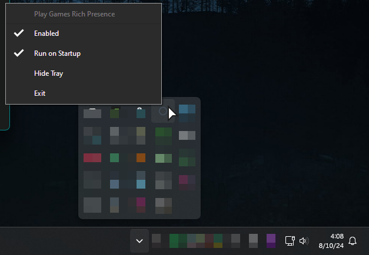
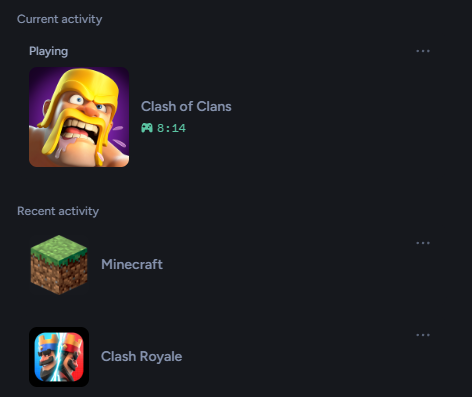

> [!NOTE]
> Additional options available in the Tray Icon

## Table of Contents
- [Requirements](#requirements)
- [Tray Options](#tray-options)
- [Auto-Startup](#auto-startup)
- [Custom Launch Args](#custom-launch-args)
- [Previews](#previews)
- [Building from Source](#building-from-source)
- [Permissions](#permissions)

### Requirements
[.NET 8.0.X Desktop Runtime](https://dotnet.microsoft.com/en-us/download/dotnet/8.0) (x64)

---
### Tray Options

- Enabled (Checkbox)
- Run on Startup (Checkbox)
- Hide Tray (Button, Hides the Tray Icon until next start)
- Exit (Closes the program)

---
### Auto-Startup

Enabling `Run on Startup` clones the current launch arguments and runs it as that on startup.

---
### Custom Launch Args

| Argument                 |     Default Value     | Description                                                                                |
|:-------------------------|:---------------------:|:-------------------------------------------------------------------------------------------|
| --custom-application-id= |  1204167311922167860  | [Discord Application Id](https://discord.com/developers/applications)                      |
| --seq-url=               | http://localhost:9999 | Seq Logging Platform                                                                       |
| --bind-to=               |         `N/A`         | Binds this process to another process' ID. When the other process exits, this one does too |
| --extended-logging       |         false         | File Log Level: Verbose (From Warning)                                                     |
| --rp-disabled-on-start   |         false         | Rich Presence is Disabled for *Play Games*                                                 |
| --no-file-logging        |         false         | Disables logging to the file (Located in the current directory)                            |

**Launch Args Example**

`& '.\PlayGames RichPresence.exe' --extended-logging --seq-url=http://localhost:9999`

---
### Previews


---

## For advanced users

### Building from Source

#### Pre-Build Requirements

- [.NET SDK 8.0.X](https://dotnet.microsoft.com/en-us/download/dotnet/8.0) (x64)<br>
- [Git](https://git-scm.com/downloads)

---
#### Build Steps

**Manual**
```ps1
git clone https://github.com/JustArion/PlayGames_RichPresence && cd "PlayGames_RichPresence"
dotnet publish .\src\PlayGamesRichPresence\ --runtime win-x64 --output ./bin/
```

**Makefile**
```ps1
git clone https://github.com/JustArion/PlayGames_RichPresence && cd "PlayGames_RichPresence"
make build
```

After running these commands the output should be in the `bin` folder in the root directory of the repo.

### Permissions

A comprehensive list of permissions the application needs / could need can be found [here](permissions.md)

---

